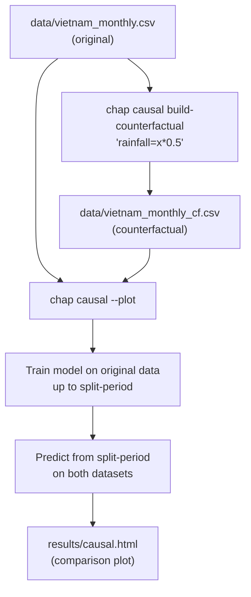

# Chap Counterfactual Comparison

This tutorial shows how to use `chap-core`'s CLI to compare model predictions under original and counterfactual climate values. You will:

1. Build a **counterfactual dataset** by modifying a climate column in the original CSV.
2. Run **`chap causal`** to train a model, generate predictions for both datasets, and produce an interactive comparison plot.

> **Caveat:** The comparison reflects the model's response to different feature values, not necessarily a true causal effect. The difference between the two prediction curves is only as causal as the model itself — confounding by other features (included or excluded) can still be present. Treat the output as a model-based sensitivity analysis rather than a causal estimate.

## Workflow



---

## Prerequisites — Installing chap-core

Follow the [chap contributor setup guide](https://chap.dhis2.org/chap-modeling-platform/contributor/chap-contributor-setup/) to install chap-core:

```bash
git clone https://github.com/dhis2-chap/chap-core.git
cd chap-core
pip install uv
uv sync
source .venv/bin/activate
chap --help   # verify the installation
```

---

## Example Data

The `data/` directory contains the Vietnam monthly dengue dataset from chap-core:

| File | Description |
|------|-------------|
| `data/vietnam_monthly.csv` | Monthly dengue cases, rainfall, and temperature for Vietnamese provinces (1994 onwards) |
| `data/vietnam_monthly.geojson` | Geographic boundaries for Vietnamese provinces |

**CSV columns:**

| Column | Description |
|--------|-------------|
| `time_period` | Month in `YYYY-MM` format |
| `rainfall` | Monthly rainfall (mm) |
| `mean_temperature` | Mean temperature (°C) |
| `disease_cases` | Reported dengue cases |
| `population` | Province population |
| `location` | Province name |

---

## Step 1 — Build a Counterfactual Dataset

`chap causal build-counterfactual` creates a modified copy of your CSV by applying a mathematical expression to one or more columns. Use `x` to refer to the original cell value.

The following command simulates a **50% reduction in rainfall** across the entire time series:

```bash
chap causal build-counterfactual \
    data/vietnam_monthly.csv \
    "rainfall=x*0.5" \
    --output-csv data/vietnam_monthly_cf.csv
```

This produces `data/vietnam_monthly_cf.csv` with the `rainfall` column halved everywhere.

**Apply the transformation only from a specific month onward:**

```bash
chap causal build-counterfactual \
    data/vietnam_monthly.csv \
    "rainfall=x*0.5" \
    --start-time-period 2015-01 \
    --output-csv data/vietnam_monthly_cf.csv
```

**Expression syntax:**

| Construct | Examples |
|-----------|---------|
| Original value | `"x"` |
| Arithmetic operators | `"x*0.5"`, `"x+10"`, `"x-5"`, `"x/2"`, `"x**2"` |
| Functions | `"abs(x)"`, `"round(x)"` |
| Combinations | `"abs(x*0.1-5)"`, `"round(x+0.5)"` |
| Multiple columns | `"rainfall=x*0.5" "mean_temperature=x-2"` |

Missing values (`NaN`) are preserved unchanged regardless of the expression.

---

## Step 2 — Generate a Comparison Plot

`chap causal` trains a model on the original dataset, then predicts from a chosen split period to the end of both the original and counterfactual datasets. With `--plot` it writes an interactive HTML comparison.

```bash
mkdir -p results
chap causal \
    --model-name https://github.com/dhis2-chap/minimalist_example_lag \
    --dataset-csv data/vietnam_monthly.csv \
    --counterfactual-csv data/vietnam_monthly_cf.csv \
    --counterfactual-columns rainfall \
    --split-period 2019-01 \
    --output-file results/causal.nc \
    --plot
```

**What each argument does:**

| Argument | Description |
|----------|-------------|
| `--model-name` | Model to use — a GitHub URL or local path |
| `--dataset-csv` | The original (observed) dataset |
| `--counterfactual-csv` | The counterfactual dataset produced in Step 1 |
| `--counterfactual-columns` | Columns that differ between the two datasets (space-separated if more than one) |
| `--split-period` | Period that separates the training window (before) from the prediction window (from this period to the end of the dataset) |
| `--output-file` | Path for the NetCDF results file |
| `--plot` | Also write an HTML comparison plot alongside the NetCDF files |

The model is trained **once** on the original data up to (but not including) `2019-01`, then predictions are generated for both datasets from `2019-01` onwards.

---

## Output

After the command completes you will find:

```
results/
├── causal.nc       # predictions for the original dataset
├── causal_cf.nc    # predictions for the counterfactual dataset
└── causal.html     # interactive side-by-side comparison plot
```

Open `results/causal.html` in a browser to explore how the predicted disease burden differs between the original climate conditions and the counterfactual scenario.
